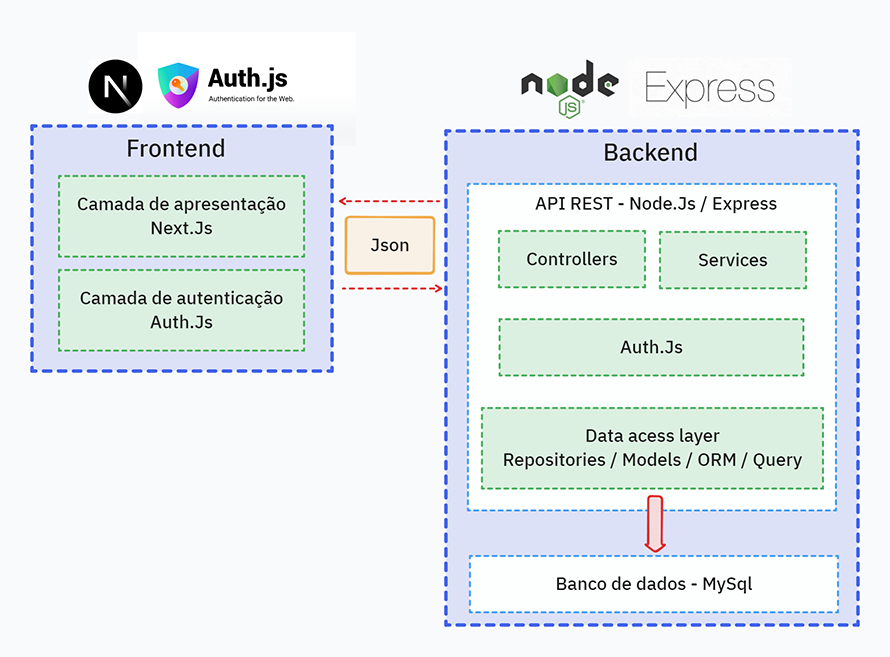

<div align="center">
  

  <h1>APC FIT PRO</h1>
</div>

# Introdução

O APC FIT PRO é uma plataforma completa para prescrição, avaliação e controle de treinos físicos, unindo ciência e tecnologia para revolucionar a experiência de profissionais de educação física e alunos. Baseado no método “Avaliar, Planejar e Controlar” (APC), oferece avaliação detalhada, planejamento personalizado e controle preciso de carga em uma única solução. O grande diferencial está na personalização avançada, integração entre profissionais e alunos, e ajustes contínuos para otimizar resultados.

---

# Visão Geral do Projeto

- **Objetivo:** Oferecer avaliações detalhadas, planejamento personalizado e controle preciso de treinos, tudo em um só lugar, com base no método APC.
- **Diferencial:** Personalização avançada, integração entre profissionais e alunos, e ajustes contínuos para otimizar resultados.

---

# Diagrama de Arquitetura em Camadas

<div align="center">
   
</div>

---

# Arquitetura do Sistema

O sistema é dividido em duas grandes partes: **Frontend** e **Backend**.

## ☁️ Microserviço de Mensageria (CloudAMQP/RabbitMQ)

- **Função:** Responsável pela comunicação assíncrona entre serviços do sistema, utilizando filas para processar eventos, tarefas e integrações de forma desacoplada.
- **Integração:** O backend (`apcpro-api`) publica e consome mensagens via CloudAMQP, permitindo escalabilidade e maior resiliência no processamento de dados.
- **Tecnologia:** [CloudAMQP](https://www.cloudamqp.com/) (RabbitMQ gerenciado na nuvem).

## 🌐 Frontend (`apcpro-web`)

- **Framework:** [Next.js](https://nextjs.org/) (React)
- **Componentes UI:** [Shadcn](https://ui.shadcn.com/) e [Tailwind CSS](https://tailwindcss.com/)
- **Autenticação:** [NextAuth.js](https://next-auth.js.org/)
- **Linguagem:** [TypeScript](https://www.typescriptlang.org/)
- **Estrutura:**
  - `app/`: Páginas e rotas do sistema (ex: `/dashboard`, `/setup-profile`)
  - `components/`: Componentes reutilizáveis e de interface
  - `lib/`: Funções utilitárias e integração com API
  - `services/`: Comunicação com o backend
  - `public/`: Arquivos estáticos (imagens, ícones, etc.)

## 🖥️ Backend (`apcpro-api`)

- **Framework:** [Express](https://expressjs.com/) (Node.js)
- **ORM:** [Prisma](https://www.prisma.io/docs/) (acesso ao banco de dados)
- **Linguagem:** [TypeScript](https://www.typescriptlang.org/)
- **Estrutura:**
  - `controllers/`: Recebem requisições HTTP e retornam respostas
  - `services/`: Lógica de negócio (ex: criação de perfis, regras de treino)
  - `repositories/`: Acesso ao banco de dados via Prisma
  - `middlewares/`: Autenticação, validação, etc.
  - `models/`: Tipos e interfaces do sistema
  - `routes.ts`: Define os endpoints da API

## 🔒 Autenticação

- Utiliza o **NextAuth.js** tanto no frontend quanto no backend para autenticação segura, gerenciamento de sessões e integração com provedores OAuth (ex: Google).

## 📅 Banco de Dados - PostgreSQL

- **Armazenamento Persistente:** Tabelas para usuários, treinos, avaliações, etc.
- **Relacionamentos:** Relacionamentos entre entidades.

---

# Fluxo Típico do Sistema

1. Usuário interage com a interface Next.js.
2. Frontend faz requisição à API Node.js.
3. API valida autenticação via Auth.js.
4. Controller processa requisição e chama o Service apropriado.
5. Service aplica regras de negócio e usa a Data Access Layer.
6. Data Access Layer interage com o banco de dados **PostgreSQL**.
7. Resposta retorna pelas camadas até o frontend.
8. Next.js atualiza a interface com os dados recebidos.

---

# Estrutura do Projeto

## Raiz do Projeto

- **apcpro-api**: Diretório do backend, desenvolvido com Node.js, Express e Prisma.
- **apcpro-web**: Diretório do frontend, desenvolvido com Next.js e Shadcn.
- **CloudAMQP:** Instância gerenciada de RabbitMQ utilizada para mensageria entre serviços (configuração via variáveis de ambiente).
- **`.github/`**: Arquivos de configuração e workflows do GitHub Actions.
- **`README.md`**: Documentação principal do projeto.

## Backend (apcpro-api)

- **`src/`**: Código-fonte principal do backend.
  - **`controllers/`**: Controladores para gerenciar requisições.
  - **`services/`**: Lógica de negócios.
  - **`repositories/`**: Acesso ao banco de dados com Prisma.
  - **`middlewares/`**: Middlewares para autenticação e validação.
  - **`models/`**: Interfaces e tipos do sistema.
  - **`utils/`**: Funções utilitárias.
  - **`routes.ts`**: Definição das rotas da API.
- **`prisma/`**: Configuração do Prisma.
  - **`schema.prisma`**: Esquema do banco de dados.
  - **`migrations/`**: Migrações do banco de dados.
- **`.env`**: Variáveis de ambiente.
- **`package.json`**: Dependências e scripts do backend.

## Frontend (apcpro-web)

- **`src/`**: Código-fonte principal do frontend.
  - **`app/`**: Estrutura de páginas do Next.js.
    - **`dashboard/`**: Página principal do dashboard.
    - **`setup-profile/`**: Página de configuração de perfil.
  - **`components/`**: Componentes reutilizáveis.
    - **`ui/`**: Componentes de interface (ex.: botões, formulários).
  - **`lib/`**: Funções utilitárias e abstrações.
  - **`services/`**: Comunicação com a API backend.
- **`public/`**: Arquivos estáticos (imagens, ícones, etc.).
- **`.env`**: Variáveis de ambiente.
- **`package.json`**: Dependências e scripts do frontend.

---

# Tecnologias

> **💡 Dica:** Consulte a documentação oficial de cada tecnologia para aproveitar ao máximo suas funcionalidades e entender como elas contribuem para a robustez e escalabilidade do sistema.

    

- [Next.js](https://nextjs.org/) - Framework React para construção de aplicações web modernas, com suporte a SSR e SSG.
- [Node.js](https://nodejs.org/) - Ambiente de execução JavaScript no lado do servidor.
- [Express](https://expressjs.com/) - Framework minimalista para Node.js.
- [Prisma](https://www.prisma.io/docs/) - ORM moderno e flexível para banco de dados.
- [NextAuth.js](https://next-auth.js.org/) - Biblioteca para autenticação segura e escalável.
- [Shadcn](https://ui.shadcn.com/) - Componentes UI acessíveis e reutilizáveis.
- [Tailwind CSS](https://tailwindcss.com/) - Framework CSS utilitário para estilização rápida e responsiva.
- [TypeScript](https://www.typescriptlang.org/) - Tipagem estática para melhor manutenção e escalabilidade.
- [CloudAMQP (RabbitMQ)](https://www.cloudamqp.com/) - Mensageria e filas para comunicação assíncrona entre microserviços.

---

# Getting Started

## 1. Clone o repositório

```bash
# Navegue até o diretório onde deseja clonar o repositório
cd /caminho/para/seu/diretorio

# Clone o repositório do projeto
git clone https://alexsrs@dev.azure.com/alexsrs/APC%20PRO/_git/APC%20PRO

# Acesse o diretório do projeto
cd APC\ PRO
```

## 2. Instale as dependências

```bash
# Backend
cd apcpro-api
npm install
npm run start:dev

# Frontend
cd ../apcpro-web
npm install
npm run dev
```

## 3. Configure as variáveis de ambiente

```bash
# Backend
copy /apcpro-api/.env.example /apcpro-api/.env

# Frontend
copy /apcpro-web/.example.env.local /apcpro-web/.env.local
```

---

# Build e Testes

## Build

```bash
# Backend
cd apcpro-api
npm run build

# Frontend
cd ../apcpro-web
npm run build
```

## Testes

```bash
# Backend
cd apcpro-api
npm run test

# Frontend
cd ../apcpro-web
npm run test
```

---

# Scripts Disponíveis

- `npm run dist`: Compila os arquivos TypeScript para JavaScript no diretório `dist`.
- `npm run start:dev`: Executa o servidor em modo de desenvolvimento.
- `npm run start:watch`: Executa o servidor com suporte a recarregamento automático.
- `npm run start:dist`: Compila o projeto e executa a versão compilada.

---

# ✅ Funcionalidades Implementadas

O APC FIT PRO já possui as seguintes funcionalidades plenamente desenvolvidas e testadas:

## 🔐 Autenticação e Gestão de Usuários

- ✅ **Autenticação NextAuth.js:** Login via Google OAuth e email/senha
- ✅ **Gestão de Perfis:** Criação e edição de perfis para professores e alunos
- ✅ **Configuração Inicial:** Setup Profile com escolha de papel (professor/aluno)
- ✅ **Relacionamentos:** Vinculação professor-aluno com convites por link
- ✅ **Middleware de Autenticação:** Proteção de rotas e validação JWT

## 📊 Sistema de Avaliações Físicas

### 1. Triagem Inteligente APC
- ✅ **Questionário Automatizado:** Identificação do objetivo principal (Controle de Doença, Saúde/Bem-estar, Estética/Hipertrofia, Alta Performance)
- ✅ **Classificação Automática:** Algoritmo de classificação baseado nas respostas
- ✅ **Validação de Avaliação:** Sistema para verificar se aluno possui avaliação válida

### 2. Anamnese Estratégica Completa
- ✅ **Entrevista Aprofundada:** Perguntas segmentadas por objetivo identificado
- ✅ **Histórico Médico:** Coleta de informações sobre lesões, limitações e condições de saúde
- ✅ **Preferências e Logística:** Análise de disponibilidade, preferências e comprometimento
- ✅ **Integração com Triagem:** Abertura automática após triagem (exceto para Alto Rendimento)

### 3. Avaliação Antropométrica e Composição Corporal
- ✅ **Coleta Completa:** Peso, altura, circunferências (pescoço, cintura, quadril, membros) e dobras cutâneas
- ✅ **Cálculos Automáticos:** IMC, percentual de gordura (múltiplas fórmulas), RCQ, CA, MME
- ✅ **Classificações:** Resultados classificados por sexo, idade com referências clínicas (OMS, ACSM)
- ✅ **Organização por Regiões:** Divisão em tronco, membros superiores e inferiores

## 📈 Controle e Acompanhamento

- ✅ **Histórico de Avaliações:** Lista completa das avaliações realizadas por aluno
- ✅ **Próxima Avaliação:** Cálculo automático da data de reavaliação (90 dias)
- ✅ **Evolução Física:** Comparação entre avaliações com indicadores de melhoria/declínio
- ✅ **Métricas de Progresso:** Análise de peso, percentual de gordura e massa muscular
- ✅ **Detalhamento Completo:** Visualização detalhada de resultados das avaliações

## 🔔 Sistema de Alertas Inteligentes

- ✅ **Mensageria CloudAMQP:** Integração com RabbitMQ para notificações assíncronas
- ✅ **Alertas Automáticos:** Notificações geradas após cadastro de avaliações
- ✅ **Alertas por Usuário:** Sistema persistente de alertas para professores e alunos
- ✅ **API de Alertas:** Endpoints para consumo e gestão de notificações

## 👥 Dashboards Específicos

### Dashboard do Professor
- ✅ **Gestão de Alunos:** Lista, busca e visualização de alunos vinculados
- ✅ **Métricas do Professor:** Total de alunos, novos cadastros, alunos ativos
- ✅ **Convite de Alunos:** Sistema de convite via link com professorId
- ✅ **Visualização de Avaliações:** Acesso completo às avaliações dos alunos
- ✅ **Alertas Inteligentes:** Notificações específicas para o professor

### Dashboard do Aluno
- ✅ **Métricas Pessoais:** Treinos realizados, próxima avaliação, evolução física
- ✅ **Ações Rápidas:** Acesso direto para triagem, anamnese e medidas corporais
- ✅ **Histórico Completo:** Visualização de todas as avaliações realizadas
- ✅ **Alertas Personalizados:** Notificações relevantes para o aluno

## 🛠️ Infraestrutura e API

- ✅ **API RESTful Completa:** 25+ endpoints documentados com Swagger
- ✅ **Documentação Swagger:** Interface interativa para testes da API
- ✅ **Health Check:** Monitoramento de status da aplicação
- ✅ **Métricas do Sistema:** Endpoints para monitoramento de performance
- ✅ **CORS Configurado:** Suporte para requisições cross-origin
- ✅ **Deploy Azure:** Configuração completa para produção no Azure
- ✅ **Banco PostgreSQL:** Schema Prisma com 20+ migrações aplicadas

## 🎨 Interface e Experiência

- ✅ **Design Responsivo:** Interface adaptável para desktop, tablet e mobile
- ✅ **Componentes Shadcn:** UI moderna e acessível
- ✅ **Sidebar Dinâmica:** Navegação adaptada por perfil (professor/aluno)
- ✅ **Modais Interativos:** Interfaces para triagem, anamnese e medidas corporais
- ✅ **Loading States:** Indicadores de carregamento em todas as operações
- ✅ **Tratamento de Erros:** Validação e feedback em tempo real

---

# 🔄 Fluxo Implementado da Avaliação Física

1. **Aluno Entra no Sistema** → Verifica se possui avaliação válida
2. **Sem Avaliação Válida** → Abre automaticamente a Triagem
3. **Triagem Concluída** → Classifica objetivo e decide próximo passo
4. **Objetivo Não-Esportivo** → Abre automaticamente a Anamnese
5. **Anamnese Concluída** → Aluno pode acessar Medidas Corporais
6. **Medidas Corporais** → Cálculos automáticos e classificações
7. **Histórico Completo** → Todas as avaliações ficam disponíveis
8. **Evolução Física** → Comparações automáticas entre avaliações
9. **Alertas Gerados** → Professor recebe notificações via mensageria

> Todo o fluxo é automatizado, seguro e baseado em evidências científicas, promovendo avaliações detalhadas e prescrições individualizadas.

---

# Contribuindo

Contribuições são bem-vindas! Siga as etapas abaixo para contribuir com o projeto:

1. **Faça um fork do repositório**.
2. **Clone o repositório forkado**.
3. **Crie uma nova branch para sua contribuição**.
4. **Faça suas alterações** seguindo as melhores práticas.
5. **Teste suas alterações**.
6. **Envie suas alterações**.
7. **Abra um Pull Request**.

Agradecemos por contribuir para o APC FIT PRO! 😊

---

<div align="center">
  <p><sub>Feito com 💙 por <a href="https://github.com/alexsrs">Alex Sandro R. de Souza</a></sub></p>
</div>
