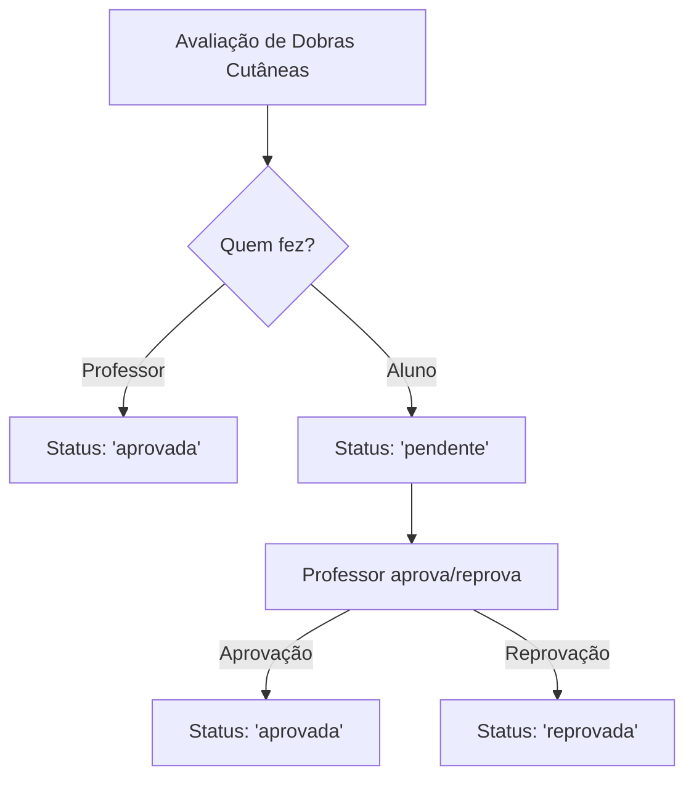

# Correção do Status das Avaliações de Dobras Cutâneas

## 🔍 Problema Identificado

As avaliações de dobras cutâneas realizadas por professores estavam sendo salvas com status `CONCLUIDA` em vez de `aprovada`.

### Exemplo do problema:
```json
{
  "id": "cmcrw03fx0001vnnozfso8hfl",
  "userPerfilId": "cmbqaqqv30003v0ko10bzn6nd", 
  "tipo": "dobras-cutaneas",
  "status": "CONCLUIDA", // ❌ INCORRETO
  "metadata": {
    "calculadoPor": "cmbpudp780000v07cqw1p7esm" // Professor que fez o cálculo
  }
}
```

## ✅ Solução Implementada

### 1. **Correção no Service (`dobras-cutaneas-service.ts`)**

**Antes:**
```typescript
const avaliacaoSalva = await prisma.avaliacao.create({
  data: {
    userPerfilId: input.userPerfilId,
    tipo: 'dobras-cutaneas',
    status: 'CONCLUIDA', // ❌ Sempre "CONCLUIDA"
    resultado: avaliacaoCompleta as any
  }
});
```

**Depois:**
```typescript
// Definir status: se foi calculado por um professor, deve ser 'aprovada', senão 'pendente'
const status = calculadoPor ? 'aprovada' : 'pendente';

const avaliacaoSalva = await prisma.avaliacao.create({
  data: {
    userPerfilId: input.userPerfilId,
    tipo: 'dobras-cutaneas',
    status: status, // ✅ Dinâmico baseado em quem fez
    resultado: avaliacaoCompleta as any
  }
});
```

### 2. **Atualização do Model (`dobras-cutaneas-model.ts`)**

**Antes:**
```typescript
export type StatusAvaliacao = 'PENDENTE' | 'CONCLUIDA' | 'CANCELADA';
```

**Depois:**
```typescript
export type StatusAvaliacao = 'pendente' | 'aprovada' | 'reprovada' | 'cancelada';
```

## 🎯 Lógica de Negócio

### **Quando uma avaliação de dobras cutâneas deve ser:**

1. **`aprovada`**: Quando calculada por um professor (campo `calculadoPor` preenchido)
2. **`pendente`**: Quando feita pelo próprio aluno (sem `calculadoPor`)

### **Fluxo esperado:**



## 📝 Impacto

- ✅ Avaliações feitas por professores não aparecerão mais na lista de "pendentes"
- ✅ Avaliações feitas por alunos continuarão pendentes até aprovação
- ✅ Interface de aprovação funcionará corretamente
- ✅ Fluxo de trabalho mais lógico e eficiente

## 🚀 Resultado

Agora as avaliações de dobras cutâneas seguem a mesma lógica das demais avaliações:
- **Professor faz** → Status `aprovada` (não precisa de aprovação adicional)
- **Aluno faz** → Status `pendente` (aguarda aprovação do professor)

---
*Correção aplicada em: 6 de julho de 2025*
*Arquivos modificados: `dobras-cutaneas-service.ts`, `dobras-cutaneas-model.ts`*
